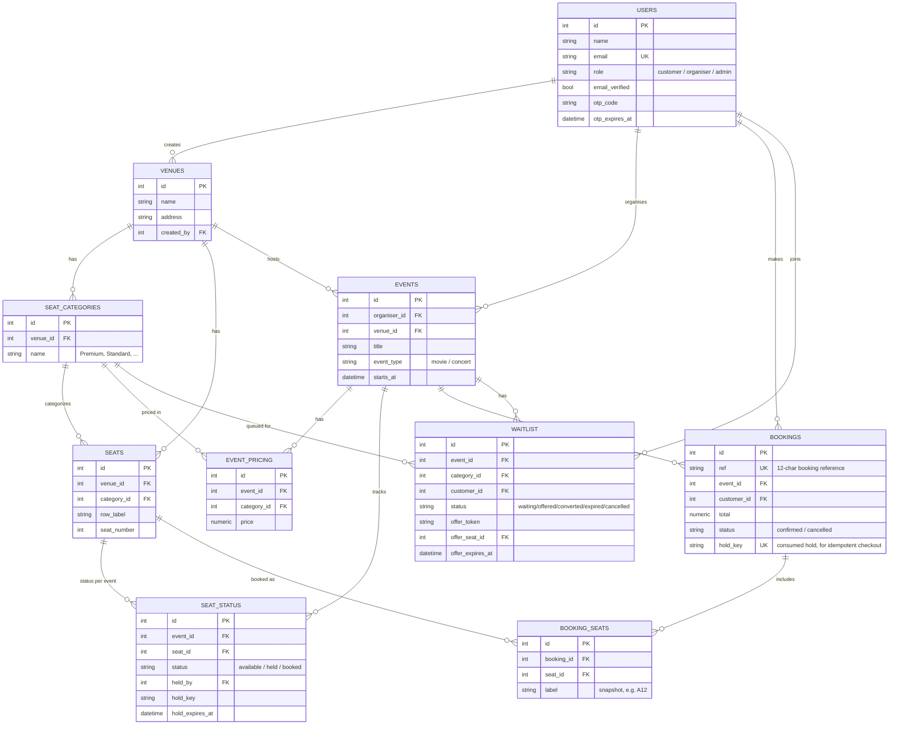

# Ticket Booking System

### 🔗 Live site: **https://ticket-booking-api-1sps.onrender.com**


A ticket booking platform for movies/concerts: customers browse events, book seats from
a visual seat map with real-time status, held seats auto-release on abandonment, sold-out
shows have a waitlist with automatic seat offers on cancellation, and every confirmed
booking gets an emailed QR code ticket.

Backend: Flask + SQLAlchemy + PostgreSQL. Frontend: HTML/CSS/JS.

---

## Table of contents
- [Features](#features)
- [Tech stack](#tech-stack)
- [Project structure](#project-structure)
- [Setup guide](#setup-guide)
- [Environment variables](#environment-variables)
- [Database schema](#database-schema)
- [API documentation](#api-documentation)
- [Seat hold & concurrency logic](#seat-hold--concurrency-logic)
- [Waitlist & time-limited offer logic](#waitlist--time-limited-offer-logic)
- [QR code & email](#qr-code--email)
- [Deployment](#deployment)
- [Testing](#testing)
- [Architecture & trade-offs](#architecture--trade-offs)

---

## Features

- **Admin** — create/manage venues, seat categories (Premium/Standard/...), bulk seat
  layout creation
- **Organiser** — register, log in, create movie/concert listings with venue, date, time,
  and per-category pricing; view booking summary + revenue per event
- **Customer** — register, log in, browse/filter events, view a live seat map, hold seats
  with a countdown timer, checkout, view booking history, cancel a booking
- **Concurrency-safe seat holds** — a configurable TTL (default 10 min); two customers can
  never hold or book the same seat, enforced at the database level, not just in application
  code
- **Waitlist** — join a queue for a sold-out category; when a seat frees up it's offered to
  the next person in line with a time-limited emailed link; if they don't claim it in time,
  it cascades automatically to the next person
- **Email OTP verification** — customer/organiser accounts must verify a 6-digit emailed
  code before they can log in (added after initial deployment, not in the original spec)
- **QR code tickets** — every confirmed booking emails an HTML confirmation with a QR code
  (encoding the booking reference) attached as a PNG

---

## Tech stack

| Layer | Choice |
|---|---|
| Backend | Flask, SQLAlchemy (Flask-SQLAlchemy) |
| Auth | Flask-JWT-Extended (JWT bearer tokens) |
| Database | PostgreSQL (no Redis — seat holds/offers are rows with `*_expires_at` timestamps) |
| Scheduled sweeps | APScheduler (in-process background thread) |
| QR codes | `qrcode` + `Pillow` |
| Email | Brevo's HTTP API via plain `requests` (not SMTP — see [Deployment](#deployment)) |
| Frontend | Plain HTML/CSS/JS, no build step, served by Flask itself |
| Hosting | Render (web service + managed Postgres) |

---

## Project structure

```
app/
  __init__.py          # app factory: config, blueprints, static frontend, scheduler
  extensions.py         # db, jwt singletons
  scheduler.py           # APScheduler wiring — sweeps expired holds/offers
  models/                 # one file per table (see Database schema)
  routes/                  # one blueprint per resource — thin, HTTP-shape only
    auth.py                  # register/login/verify-email/resend-otp/me
    venues.py                 # admin: venue/category/seat CRUD
    events.py                  # organiser: event/pricing CRUD, summary, bookings
    browse.py                   # public: browse/filter events, seat map
    bookings.py                  # customer: hold/checkout/release, booking history
    waitlist.py                   # customer: join waitlist, claim an offer
  services/               # business logic — the routes call into these
    seat_service.py          # hold/checkout/cancel, the concurrency core
    waitlist_service.py       # join/offer/claim/expire
    ticket_service.py          # QR generation + confirmation email
  utils/                  # small shared helpers (auth, dates, email, locking, otp)
frontend/                # plain HTML/CSS/JS, no build step
  index.html, login.html, register.html, verify-email.html, event.html,
  bookings.html, claim-offer.html, organiser.html, admin.html
  css/style.css, js/api.js, js/nav.js
config.py                # env-driven Config class
run.py                    # WSGI entry point (`app = create_app()`)
requirements.txt
render.yaml               # Render Blueprint (web service + Postgres)
PROJECT_BRIEF.md          # full build log / design-decision history (long, detailed)
```

---

## Setup guide

### Prerequisites
- Python 3.11 or 3.12 (**not 3.13+** — `psycopg2-binary` has no prebuilt wheel past 3.12;
  see [Architecture & trade-offs](#architecture--trade-offs))
- PostgreSQL 12+ (local install, or a free instance from Render/Railway/Supabase/etc.)

### 1. Clone and install
```bash
git clone https://github.com/balaji2005239/ticket-booking.git
cd ticket-booking
python3 -m venv .venv
source .venv/bin/activate          # Windows: .venv\Scripts\activate
pip install -r requirements.txt
```

### 2. Configure environment
```bash
cp .env.example .env
```
Edit `.env` — at minimum set `DATABASE_URL` to a real Postgres instance. Email
(`BREVO_API_KEY`, `EMAIL_FROM_ADDRESS`) is optional for local dev: without it,
`send_email()` fails soft (logs a warning, booking/waitlist flows still work) — see
[Environment variables](#environment-variables) for the full reference.

### 3. Run it
```bash
python run.py
```
This creates all tables (`db.create_all()` — no migration system, see
[Architecture & trade-offs](#architecture--trade-offs)) and starts the server at
`http://localhost:5000`, serving both the API (`/api/...`) and the frontend (`/`).

### 4. Seed an admin account
Admins are **not** self-registered (`POST /api/auth/register` explicitly rejects
`"role": "admin"`) — an operator seeds one directly:
```python
from app import create_app
app = create_app()
with app.app_context():
    from app.extensions import db
    from app.models import User, ROLE_ADMIN

    admin = User(name="Admin", email="admin@example.com", role=ROLE_ADMIN, email_verified=True)
    admin.set_password("choose-a-real-password")
    db.session.add(admin)
    db.session.commit()
```
Run that as a one-off script (`python -c "..."` or a `.py` file) against your configured
`DATABASE_URL`. Log in at `/login.html` with that email/password to reach `/admin.html`.

Organiser and customer accounts register normally via `/register.html` and go through
email OTP verification (see [API documentation](#api-documentation)).

### Production start command
```bash
gunicorn run:app --workers 1
```
`--workers 1` is deliberate: the APScheduler background thread runs inside the Flask app
process, and each gunicorn worker is a separate process with its own scheduler instance —
more than one worker means duplicate sweeps of the same rows. Harmless (row locking makes
it safe) but wasteful, and this project is intentionally single-instance in scope.

---

## Environment variables

All variables, from `.env.example`:

| Variable | Required | Default | Notes |
|---|---|---|---|
| `SECRET_KEY` | recommended | `dev-secret` | Flask session secret |
| `JWT_SECRET_KEY` | recommended | `dev-jwt-secret` | JWT signing key |
| `DATABASE_URL` | **yes** | local Postgres | `postgres://` is auto-rewritten to `postgresql://` (Render/Heroku quirk) |
| `HOLD_TTL_SECONDS` | no | `600` | How long a seat hold lasts before auto-release |
| `OFFER_TTL_SECONDS` | no | `600` | How long a waitlist offer lasts before cascading to the next person |
| `SCHEDULER_INTERVAL_SECONDS` | no | `30` | How often the background sweep runs |
| `OTP_TTL_SECONDS` | no | `600` | How long a registration OTP code is valid |
| `BREVO_API_KEY` | no | — | From Brevo's dashboard: **SMTP & API → API Keys** tab (not the SMTP tab — different credential). Without it, emails are skipped (logged, not sent), everything else still works |
| `EMAIL_FROM_ADDRESS` | no* | `noreply@example.com` | **Must be a Brevo-verified sender** or emails are silently rejected at delivery time — see the callout below |
| `EMAIL_FROM_NAME` | no | `Ticket Booking` | Display name on outgoing emails |
| `FRONTEND_BASE_URL` | no | `http://localhost:5500` | Used to build the waitlist offer's claim link — set this to wherever the frontend is actually served |

> **Email gotcha, learned the hard way**: Brevo (and most transactional email providers)
> accept the API call from an unverified sender and return success — `send_email()`
> correctly returns `True` — but then silently drop the actual delivery. The only place
> that failure is visible is Brevo's own **Transactional → Email Activity** log, not
> anything in this app. Always verify your `EMAIL_FROM_ADDRESS` as a sender in Brevo
> first (**Senders, Domains & Dedicated IPs → Senders**).

> **Why Brevo's HTTP API and not SMTP**: this app originally used `smtplib` against
> Brevo's SMTP relay. On Render specifically, outbound SMTP is blocked entirely at the
> network level — confirmed by testing valid SMTP credentials that authenticated
> successfully from an unrestricted machine, then timed out on every port (587/465/2525)
> when the identical code ran on Render. An HTTP POST on port 443 has no such problem.
> See `app/utils/email.py`'s docstring and `PROJECT_BRIEF.md` for the full trail.

---

## Database schema

PostgreSQL, no migrations (`db.create_all()` on startup — see
[Architecture & trade-offs](#architecture--trade-offs)).



**The concurrency core** is `seat_status`: one row per `(event_id, seat_id)`, enforced by
a unique constraint, with `status` plus hold bookkeeping (`held_by`, `hold_key`,
`hold_expires_at`). Every hold/checkout/cancel transaction locks the relevant rows with
`SELECT ... FOR UPDATE` before reading or writing them — see
[Seat hold & concurrency logic](#seat-hold--concurrency-logic).

**Notable non-obvious relationships**:
- `Event.seat_statuses` cascades on delete (ephemeral live state, cleaned up with the
  event) — `Booking` has no such cascade, so an event with real bookings correctly
  blocks deletion (`409`), while an event with zero bookings can still be deleted even
  though it owns `seat_status` rows from the moment it's created.
- `Booking.hold_key` is how checkout is idempotent: a retried request with the same
  `hold_key` finds the existing booking instead of double-booking.
- A waitlist "offer" reuses the exact same hold mechanism a normal customer hold uses —
  the offered seat's `seat_status` row flips to `held` with the `Waitlist.offer_token` as
  its `hold_key`. Claiming an offer is literally a checkout using that token as the
  hold key.

---

## API documentation

All endpoints return JSON. Errors follow `{"error": "<slug>", "message": "<human text>"}`
with a matching HTTP status (`400` validation, `401` unauthorized, `403` forbidden, `404`
not found, `409` conflict, `410` expired). Authenticated endpoints expect
`Authorization: Bearer <jwt>`.

### Auth — `/api/auth` (public)

| Method | Path | Body | Notes |
|---|---|---|---|
| POST | `/register` | `name, email, password, role` | `role` is `customer` or `organiser` (`admin` → `403`). Creates an **unverified** account and emails a 6-digit OTP — **no token returned**. Re-registering an unverified email resends a fresh code instead of erroring; an already-verified email `409`s. |
| POST | `/verify-email` | `email, otp` | `400` wrong code, `404` unknown email, `410` expired. Idempotent — replaying against an already-verified account still returns a token. On success: `{token, user}`. |
| POST | `/resend-otp` | `email` | `404` unknown, `409` already verified. |
| POST | `/login` | `email, password` | `401` wrong credentials. For customer/organiser, `403 email_not_verified` if not yet verified (checked *after* the password, so a wrong-password guess and an unverified-account probe look identical). Admins are exempt (seeded directly, never self-register). On success: `{token, user}`. |
| GET | `/me` | — | Auth required. Returns the current user. |

### Admin — `/api/admin/venues` (role: admin, scoped to the creating admin)

| Method | Path | Notes |
|---|---|---|
| POST | `` | Create a venue (`name`, `address`) |
| GET | `` | List venues created by this admin |
| GET | `/<id>` | Venue detail incl. categories + seats |
| PATCH | `/<id>` | Update name/address |
| DELETE | `/<id>` | `409` if events reference it |
| POST | `/<id>/categories` | Add a seat category |
| PATCH | `/<id>/categories/<cat_id>` | Rename |
| DELETE | `/<id>/categories/<cat_id>` | `409` if seats reference it |
| POST | `/<id>/seats/bulk` | Bulk-create seats — see two body shapes below |

**Bulk seat creation**, two shapes:
```jsonc
// Generative: a block of rows sharing one category
{"rows": ["A", "B", "C"], "seats_per_row": 10, "category_id": 3, "start_seat_number": 1}

// Explicit: a full list, categories can vary per seat
{"seats": [{"row_label": "A", "seat_number": 1, "category_id": 3}, ...]}
```

### Organiser — `/api/organiser` (role: organiser, scoped to the owning organiser)

| Method | Path | Notes |
|---|---|---|
| GET | `/venues` | Browse all admin-created venues (read-only, for picking one) |
| GET | `/venues/<id>` | Venue detail + categories |
| POST | `/events` | Create event: `title, event_type, description, venue_id, starts_at`, optional inline `pricing: [{category_id, price}]` |
| GET | `/events` | List this organiser's events |
| GET | `/events/<id>` | Detail incl. pricing |
| PATCH | `/events/<id>` | Update title/description/event_type/starts_at (`venue_id` is immutable after creation) |
| DELETE | `/events/<id>` | `409` if bookings reference it |
| PUT | `/events/<id>/pricing` | Upsert one category's price: `{category_id, price}` |
| DELETE | `/events/<id>/pricing/<cat_id>` | Remove a category's price |
| GET | `/events/<id>/summary` | Confirmed/cancelled counts, total revenue, seats booked, revenue-by-category |
| GET | `/events/<id>/bookings` | Booking list for the event, with customer info |

### Browse — `/api/events` (public, no auth)

| Method | Path | Notes |
|---|---|---|
| GET | `` | List/filter events — query params: `event_type`, `venue_id`, `q` (title search), `date` (`YYYY-MM-DD`) or `from`/`to` (ISO datetimes), `upcoming_only` (default `true`), `page`, `per_page`. Each row includes `price_from` (min category price). |
| GET | `/<id>` | Detail + per-category `availability` (total/available seat counts) + `sold_out` flag |
| GET | `/<id>/seatmap` | Seats grouped by row with live `available`/`held`/`booked` status (no PII — never reveals *who* holds a seat) |

### Bookings — `/api` (role: customer)

| Method | Path | Body | Notes |
|---|---|---|---|
| POST | `/events/<id>/hold` | `{seat_ids: [...]}` | Locks the seats (`SELECT ... FOR UPDATE`), `409` if any are already held/booked by someone else. Returns `hold_key`, `expires_at`, seat details. |
| DELETE | `/holds/<hold_key>` | — | Voluntary early release |
| POST | `/checkout` | `{hold_key}` | Converts a hold into a confirmed booking. **Idempotent** — replaying the same `hold_key` returns the existing booking. `410` if the hold expired, `404` if unknown/already consumed. Sends the QR confirmation email. |
| GET | `/bookings` | — | This customer's booking history, newest first |
| GET | `/bookings/<id>` | — | Booking detail |
| DELETE | `/bookings/<id>` | — | Cancel — frees the seat(s), triggers a waitlist offer if anyone's waiting. Idempotent (re-cancelling is a no-op). |

### Waitlist — `/api` (role: customer)

| Method | Path | Body | Notes |
|---|---|---|---|
| POST | `/events/<id>/waitlist` | `{category_id}` | Join the FIFO queue. `409` if seats are still available in that category (book directly instead), or if already on the waitlist. |
| POST | `/waitlist/claim` | `{offer_token}` | Complete the booking for an offered seat. Same idempotency/expiry semantics as `/checkout` (it *is* a checkout, using the offer token as the hold key). `410` if the offer lapsed. |

---

## Seat hold & concurrency logic

**The requirement**: two customers must never hold or book the same seat simultaneously.

**The mechanism** (`app/services/seat_service.py`):
1. Every seat has one `seat_status` row per event, with a **unique constraint on
   `(event_id, seat_id)`**.
2. Holding or checking out seats runs inside a transaction that does
   `SELECT ... FOR UPDATE` on those specific rows *before* checking or changing their
   status — a real row-level lock, not an application-level check-then-write.
3. Two requests racing for the same seat serialize: whichever transaction's `SELECT ...
   FOR UPDATE` acquires the lock first proceeds; the second blocks until the first
   commits, then re-reads the now-current state and correctly sees the seat is no
   longer available — `409`, never a double-hold.
4. Multi-seat holds sort `seat_ids` before locking, fixing the lock acquisition order
   and avoiding deadlocks between two concurrent multi-seat requests.

**TTL / auto-release**: `HOLD_TTL_SECONDS` (default 600s) is stored as
`hold_expires_at` on the `seat_status` row at hold time. `release_expired_holds()` is
the scheduler target — APScheduler (`app/scheduler.py`) calls it every
`SCHEDULER_INTERVAL_SECONDS` (default 30s), sweeping any held-but-expired row back to
`available` (also under `SELECT ... FOR UPDATE`, so a sweep racing an in-flight
checkout resolves the same way any other concurrent access does).

**Checkout is idempotent**: `Booking.hold_key` stores the consumed hold. A retried
checkout request (network retry, double-click) with the same `hold_key` finds the
existing booking and returns it rather than erroring or double-booking.

**Verified, not just implemented**: tested against real PostgreSQL with genuine
concurrent races — real customer accounts, real HTTP `POST /hold` requests, all
released at the exact same instant via `threading.Barrier` (not sequential, not a
direct DB test), against the live deployed app. Every other test in this project's
history ran against SQLite, which can't do row-level locking at all — this guarantee
specifically needed real Postgres to prove. Results at increasing contention, same
seat, every time:

| Concurrent requests for the *same* seat | Result |
|---|---|
| 2 | 1× `201`, 1× `409` — run twice, different winner each time (confirms it's a genuine race, not a fixed outcome) |
| 8 | 1× `201`, 7× `409`, all in ~1.1s wall time |
| 12 | 1× `201`, 11× `409`, all in ~1.5s wall time |

Every run: exactly one winner, zero double-bookings, zero errors, final database state
consistent with the winner. As a control, 12 customers requesting 12 **different** seats
at the same instant all succeeded (`12/12`, ~1.4s total) — confirming the serialization
above is genuine lock contention on a shared row, not just the app being slow: unrelated
seats don't block each other at all.

---

## Waitlist & time-limited offer logic

**The requirement**: sold-out category → join a waitlist; cancellation → offer to the
next person with a time-limited emailed link; unclaimed in time → offer the next person.

**The mechanism** (`app/services/waitlist_service.py`):
1. **Join** (`join_waitlist`) — only allowed when the category currently has zero
   available seats (checked live against `seat_status`); otherwise `409` (book
   directly instead). One active entry per `(event, category, customer)`.
2. **Offer** (`offer_next_in_line`) — called by `cancel_booking()` for each category a
   cancellation freed a seat in. While there's both an available seat and a waiting
   entry in that category: locks the next FIFO entry (`SELECT ... FOR UPDATE`, ordered
   by `created_at`) and an available seat, generates a random offer token, flips the
   seat's `seat_status` to `held` with that token as its `hold_key` (reusing the exact
   same mechanism a normal hold uses — no special-casing needed elsewhere), sets
   `Waitlist.status = 'offered'` with `offer_expires_at`, and emails a claim link
   (`/claim-offer.html?token=...`). Loops — one cancellation freeing several seats in a
   category can produce several offers in one call.
3. **Claim** (`claim_offer`) — is literally `checkout()` using the offer token as the
   hold key, plus flipping the `Waitlist` entry to `converted`, committed in the same
   transaction (not two separate commits) so a claim landing at the same instant as the
   expiry sweep can't leave the entry in an inconsistent status.
4. **Expire and cascade** (`expire_stale_offers`) — the other scheduler target, same
   sweep interval as hold expiry. For every offer past `OFFER_TTL_SECONDS`: re-checks
   under lock that it's still genuinely stale (a claim may have landed a moment
   earlier), frees the seat, marks the entry `expired`, then immediately calls
   `offer_next_in_line()` again for that category — so "offered to the next person"
   happens within the *same* sweep, not the next 30-second cycle.

**Verified, not just implemented**: two live runs against the actual deployed app and
real Postgres, both via real HTTP requests (not direct database manipulation), both
using **the live scheduler thread itself** to catch each expiry (not a direct function
call to `expire_stale_offers()`):

1. **The claim path**: sell out → two customers join in order → cancel → first
   customer offered and claims it → cancel again → second customer offered → their
   offer forced into the past → the live scheduler auto-expired it within ~15 seconds
   and freed the seat.
2. **Queue depth + back-to-back cascades**: 4 customers (W1-W4) waiting in order for
   one seat. Cancel → W1 offered, W2/W3/W4 untouched. Force W1's offer into the past →
   live scheduler expires it *and* offers W2 in the same sweep — W3/W4 still untouched
   (FIFO order preserved, nobody skipped ahead). Force W2's offer into the past too →
   a **second** cascade, live scheduler expires it and offers W3 — W4 still untouched.
   W3 claims successfully. W4 never received an offer at any point in this chain,
   because only one seat was ever freed. 23/23 checks passed, including the FIFO-order
   assertions after each step.

**One accepted trade-off** (documented, not an oversight): picking "the next waiting
entry" isn't perfectly linearizable if two cancellations for the *same* category race
at the exact same instant — it cannot cause a double-booked seat (the `seat_status`
locking still guarantees that independently), worst case is a seat sitting offered
slightly longer than ideal before its own TTL sweep frees it. Consistent with this
project's single-instance scope (see [Architecture & trade-offs](#architecture--trade-offs)).

---

## QR code & email

- `app/services/ticket_service.py` generates a QR code (`qrcode` library) encoding
  **just the booking reference** (e.g. `0DA2DFCE2F40`) as plain text — per the spec's
  literal wording, not a verification URL.
- Fired after a **fresh** booking only (`checkout()` and `claim_offer()`, gated on
  `created=True`) — an idempotent replay never sends a duplicate ticket email.
- The confirmation email (event, venue, date, seats, total, ref) is sent via
  `app/utils/email.py`, with the QR PNG attached as `ticket-<ref>.png`.
- The waitlist offer email is a separate email (`_send_offer_email`, not the booking
  confirmation) with the time-limited claim link.
- Both are **best-effort / fail soft**: any error is caught and logged, never breaks the
  booking/waitlist flow itself. `app.logger` is explicitly set to `INFO` level in
  `create_app()` (Flask defaults to `WARNING` outside debug mode, which was silently
  swallowing this exact diagnostic logging in production until that was fixed).

---

## Deployment

Deployed on **Render** (`render.yaml` — a Blueprint that provisions a web service +
managed Postgres together). To deploy your own copy:

1. Push this repo to your own GitHub
2. Render dashboard → **New → Blueprint** → select the repo → **Apply**
3. Fill in `BREVO_API_KEY` and `EMAIL_FROM_ADDRESS` in the Environment tab (both are
   `sync: false` in `render.yaml` — deliberately not defaulted, so a fresh deploy can't
   silently inherit a placeholder that would fail; see the callout in
   [Environment variables](#environment-variables))
4. Double-check `FRONTEND_BASE_URL` matches the URL Render actually assigns (it appends
   a random suffix if your chosen service name is taken)

**`.python-version` pins Python 3.12** — `psycopg2-binary==2.9.9` has no prebuilt wheel
past cp312, and Render's default for new services is 3.14 (as of when this was built),
which would fail to build without this pin.

**Render doesn't guarantee strict commit-order deploys** if you push multiple commits in
quick succession — a slower build of an earlier commit finishing after a newer one has
already deployed can silently revert it. Worth confirming what's actually live via an
observable behavior change after any deploy, not just a health check (a health check
can't tell you *which* commit is running).

---

## Testing

No automated test suite is checked into this repository — testing was done with ad hoc
scripts against a local Flask test client (SQLite, with `PRAGMA foreign_keys=ON` to
mirror Postgres's FK-restrict behavior) during development, plus extensive live
verification against the actual deployed app and real Postgres for anything
concurrency- or delivery-sensitive that SQLite/local testing can't prove.

**What was covered**: 284 checks across 8 areas (venues, organiser events, public
browse, seat hold/checkout, waitlist, QR/email, booking history, OTP verification) —
role-based access control, ownership isolation, validation, idempotency, cascade
behavior, and the full seat-hold/waitlist state machines. Live-only verification
(can't be done against SQLite): the actual `SELECT ... FOR UPDATE` concurrency
guarantee under genuine simultaneous request races at multiple scales (2, 8, and 12
concurrent requests for the same seat — see
[Seat hold & concurrency logic](#seat-hold--concurrency-logic)), the live APScheduler
thread actually firing on its own schedule (not just the swept function being correct)
across multiple sweep cycles in a row (see
[Waitlist & time-limited offer logic](#waitlist--time-limited-offer-logic)), and real
end-to-end email delivery.

See `PROJECT_BRIEF.md` for the full build-and-debugging history, including real bugs
caught by this testing (not by inspection): an idempotent-replay gate ordering bug in
`claim_offer()`, the `app.logger` level issue mentioned above, and a misconfigured
`EMAIL_FROM_ADDRESS` (unverified sender) that silently killed every app-sent email
until Brevo's own delivery logs — not this app's logs — revealed the reason.

---

## Architecture & trade-offs

Full reasoning lives in `PROJECT_BRIEF.md`; the short version:

- **PostgreSQL only, no Redis** — seat holds and waitlist offers are rows with
  `*_expires_at` timestamps, swept by APScheduler every ~30s, rather than a separate
  TTL-native store. Simpler hosting, one dependency, at the cost of expiry precision
  being bounded by the sweep interval rather than instant.
- **No migrations** — `db.create_all()` only creates tables that don't exist; it
  doesn't alter existing ones. Every schema change against the already-live database
  in this project needed a manual `ALTER TABLE` (see the `email_verified`/`otp_*`
  columns added for the OTP feature). Fine at this scale; would need Alembic or similar
  before this schema changes much more.
- **Plain HTML/CSS/JS frontend, no framework** — the seat map is a rendered grid
  polling `/api/.../seatmap` every 5 seconds, not a framework-driven SPA and not
  WebSocket-pushed. "Real-time" in this project means that 5-second polling window,
  not instant push — a deliberate scope decision, not an oversight.
- **Single-instance, not distributed** — no Kafka/RabbitMQ, no microservices, no CDN.
  The concepts referenced during design (two-phase tentative→confirm booking, TTL-based
  seat blocking, FIFO waitlist ordering) come from large-scale system-design write-ups
  on this exact problem (BookMyShow-style platforms), but the distributed
  infrastructure those articles describe was deliberately not adopted — this is a
  single gradeable deployment, not a high-scale production system.
- **Email via Brevo's HTTP API, not SMTP** — reversed from the original architecture
  decision after discovering Render blocks outbound SMTP entirely; see
  [Environment variables](#environment-variables).
